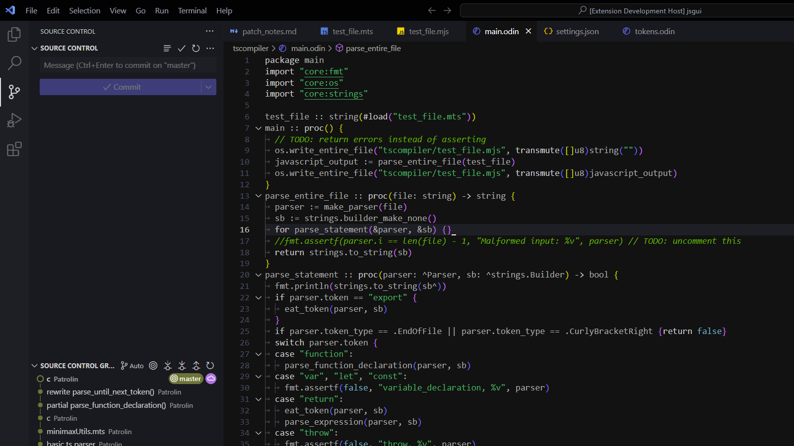

# [jblow-darker](https://github.com/Patrolin/jblow-darker)
Jon blow-like theme with darker background from [monokai darker](https://github.com/eser/vscode-one-dark-pro-monokai-darker)

Recommended settings:
- font-family: "Consolas"
- font-size: 15px
- line-height: font-size + 4px

Tested with Typescript, Python, Odin, C/C++, JSON, [Rainbow CSV](https://marketplace.visualstudio.com/items?itemName=mechatroner.rainbow-csv) and Markdown

# Screenshots

# dev

## Run
Press F5

`Ctrl+K Ctrl+O` > Open the `tests` subdirectory in this project (vscode doesn't let you open multiple copies of the same folder)

`Ctrl+Shift+P tokens` to view which token is responsible for which color

## Publish
https://code.visualstudio.com/api/working-with-extensions/publishing-extension

Check which files will be published:

`vsce package`

Publish to VS marketplace:

`vsce publish`
