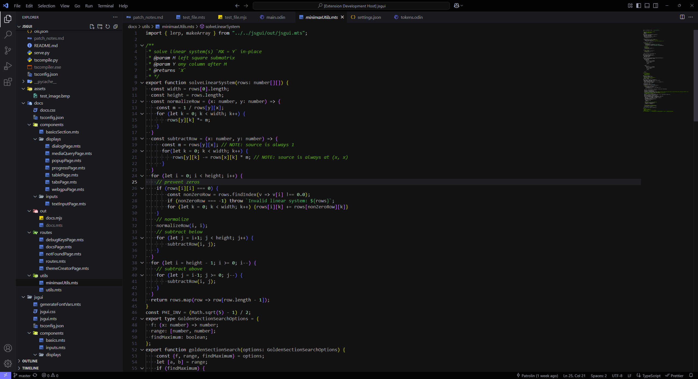
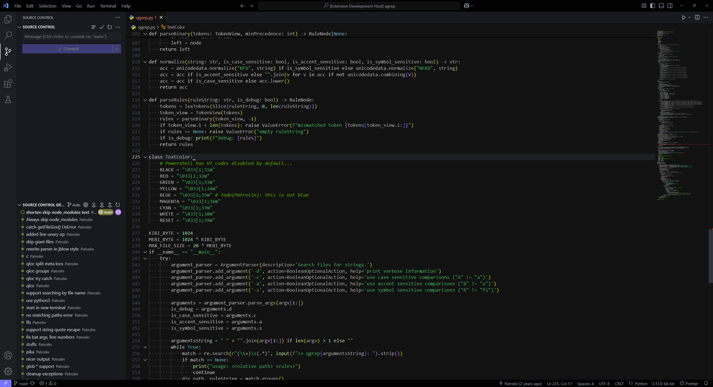
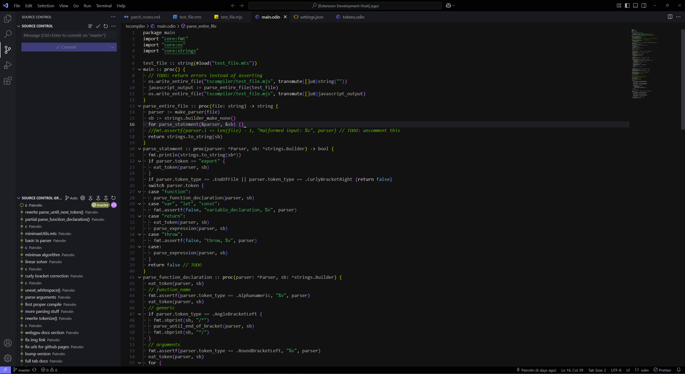
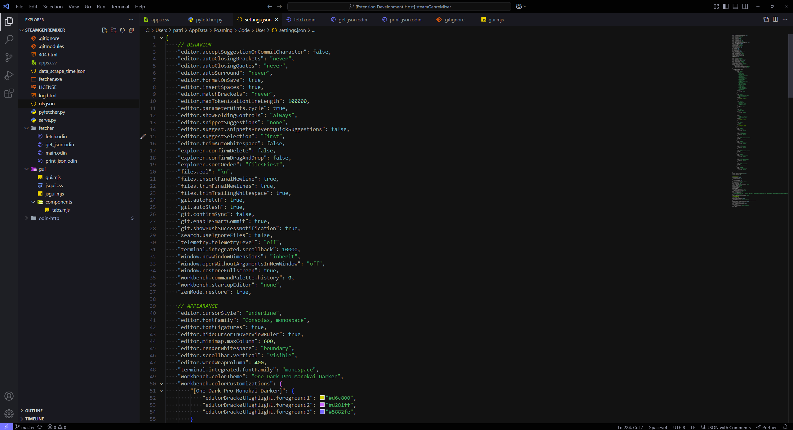
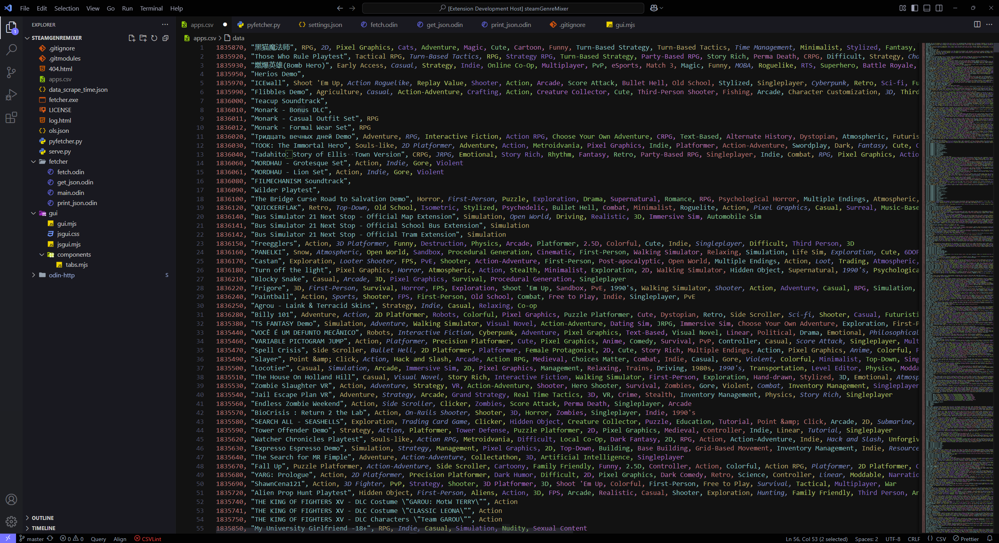
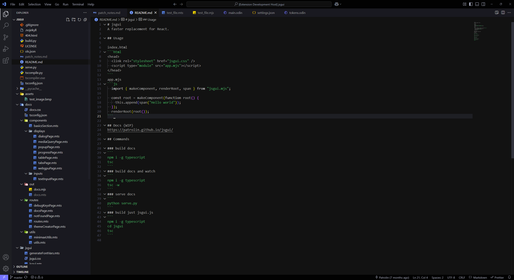

# [jblow-darker](https://github.com/Patrolin/jblow-darker)
Jon blow-like theme with darker background from [monokai darker](https://github.com/eser/vscode-one-dark-pro-monokai-darker)

Recommended settings:
- font-family: "Consolas"
- font-size: 15px
- line-height: font-size + 4px

Tested with Typescript, Python, Odin, JSON, [Rainbow CSV](https://marketplace.visualstudio.com/items?itemName=mechatroner.rainbow-csv)

# Screenshots

# dev

## Run
Press F5

## Publish
https://code.visualstudio.com/api/working-with-extensions/publishing-extension
